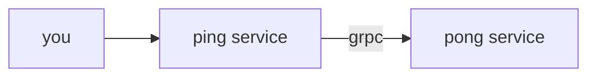

# About this project

Trying out go1.21 context cancellation cause in grpc call.



- the context that is passed from ping to pong has 1s timeout and custom ***cause*** error
- pong, when receiving the request will sleep for 2s then try to retrieve error cause from context. It will then print the err cause

# How to run the project

1. In one terminal pane, go to `pong` folder and run `go run main.go`
2. In one terminal pane, go to `ping` folder and run `go run main.go`

Call ping service using [grpcurl](https://github.com/fullstorydev/grpcurl):
```
grpcurl -plaintext -d '{"payload": "world"}' \
    localhost:8080 github_com.chfern.poc_go_grpc_cancellation.ping.proto.HelloService/HelloPong
```

This will call ping service, which internally calls pong service.

Observe the logs printed in pong service.  
Expectation: pong service should be able to retrieve "ping timeout exceeded" context error cause.
Actual: the cause error in pong service is also "context deadline exceeded"
